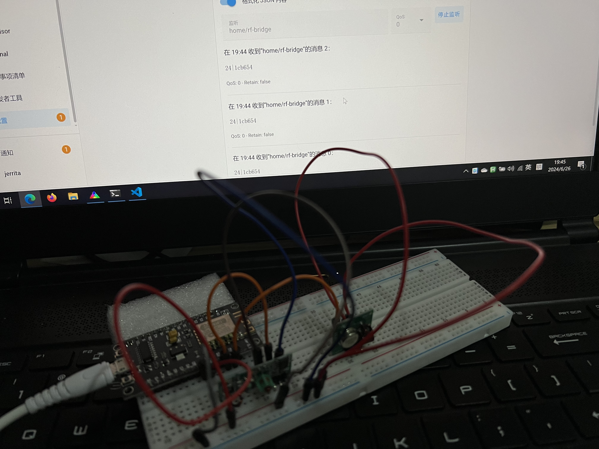
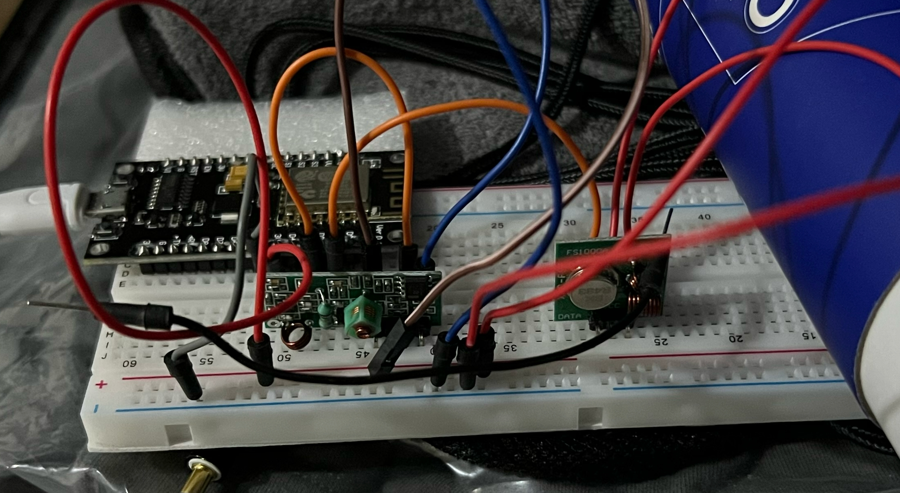

# rf-bridge

这是一个利用 NodeMCU 接入 433Mhz 射频到 Home Assistant 的项目。



## Roadmap

- [x] WiFi / MQTT 对于 HA 的接入
- [x] 射频接收测试
- [x] 射频发射测试

## Background

租房处开关较难拆卸且为明装，关灯神器只有贴开关上的那种才能正常使用，而此种开关目前只看到了射频的版本，所以需要一个能够接入 HomeAssistant 的 433Mhz 射频网关。

相较于花费 70r+ 的 Sonoff Bridge 与 100r+ 的小米音箱射频加装，显然还是包邮的 `10r MCU` + `6r 射频模块` 更有性价比。

## Installation

1. 编辑 src/main.cpp，填入 WiFi 以及 MQTT 信息。
2. 在 HA 的 `configuration.yaml` 中添加以下配置：

```yaml
mqtt:
  - button:
      unique_id: rf-bridge-x
      name: "RF Button x"
      command_topic: "home/rf-bridge/set"
      payload_press: "<int>|<hex>"
```

其中，`payload_press` 的内容为 `长度|代码`，可以在 HA 的 MQTT 界面通过监听 `home/rf-bridge` 这个 `topic` 获得，理论上可以同时接入 114514 个射频设备。

> 如果你觉得信号差，可以加根双公导线在发送端天线上，然后另一头对准你想操控的设备（如下图），也可以直接买信号加强版模块




## References
- https://nodemcu.readthedocs.io/en/release/
- https://www.jianshu.com/p/1602fa02185e
